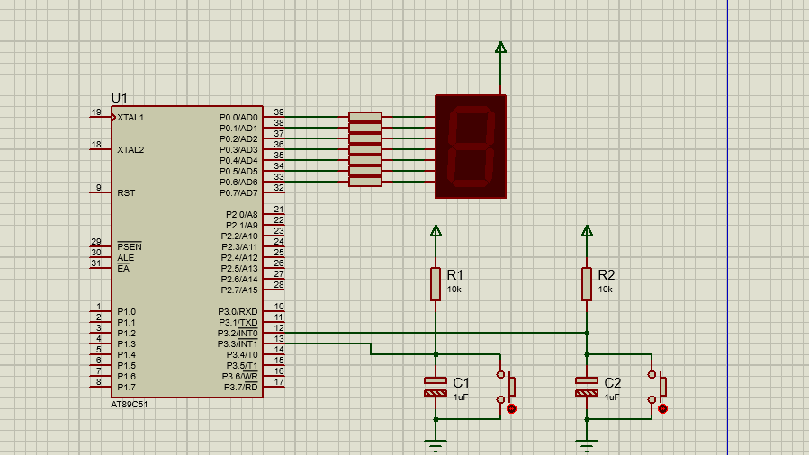

 

# Handle external interupt to display number on 7-segments led

# Description
- There are 2 buttons and 1 7-segment led on this system. Led displays a number from 0 to 9.
- The system handles the external interupt when 1 of 2 buttons is pressed.
- One button is used to increase the displayed number, while the other one is used to decrease.

# Notes:
- This the standard version of this [code](https://github.com/tienlonghungson/Hands-On-Embedded-System/tree/main/ExternalInterupt)

