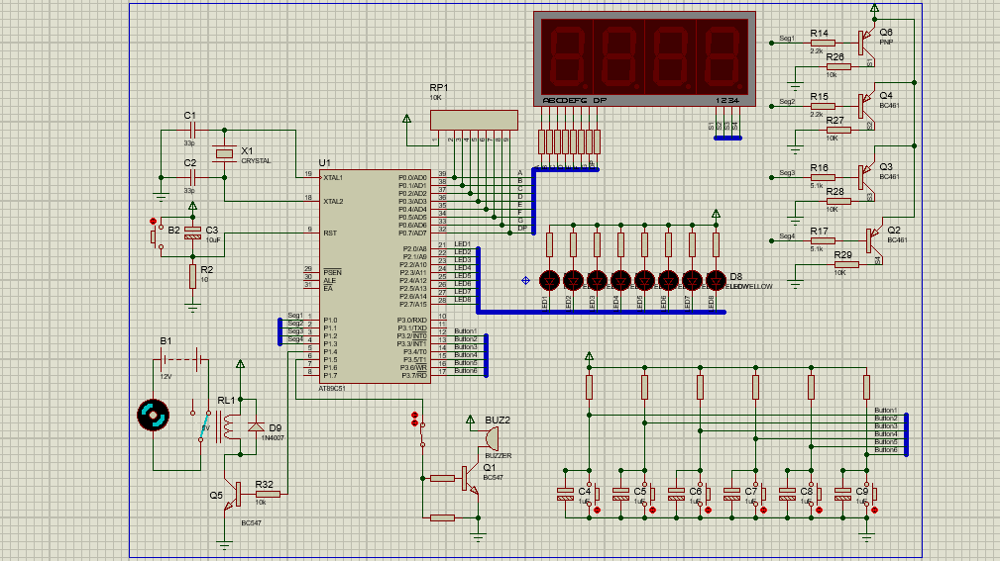

 

# Practice 1: Kitchen Timer, Led Blinking
  

# Overview
- Exercise 1 (Led Blinking): a program to blink leds in a desired pattern
- Exercise 2 (External Interrupt): handle external interrupts to control the leds' blinking patterns. The id of pattern is display in a 7-segments led's screen
- Exercise 3 (Timer): real time-delay using timer, display time in 2 7-segments leds' screen.
- Exercise 4 (Timer + External Interrupt):  a counter using timer to count real-time to 0.01 second accuracy. Time is display in format mm:ss in 4 7-segments leds's screen. Handle external interrupt to start/stop counter.
- Exercise 5 (Kitchen timer): 2 7-segments leds to display countdown time. Button 3 and 4 are used to adjust time (increase/decrease). Start counting down by button 1. A buzzer will shout until button 2 is pressed.

See the [documentation](Practice1.pdf) for more detail.
# Circuit

